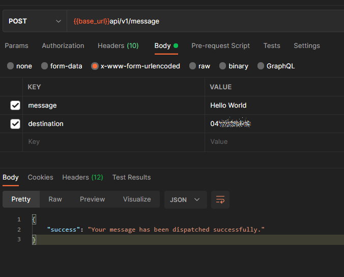
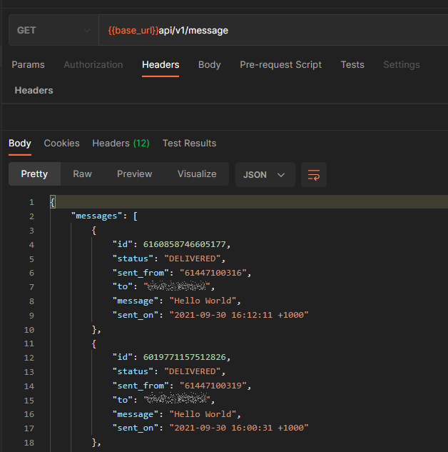

# Laravel API middleware
A test project using Laravel7x (with php7x) to build a middleware API system that communicates with an API provider (SMS GLobal in this case) to send and receive messages. The system itself is an API and returns application/json data.

# API Endpoints & Requirements

### System Requirements
- PHP ^7.2
- Laravel ^7.2

### Authentication
Basic; with the customer's specific API key and Secret provided the operator (SMS GLobal)

### API Docs (Swagger Docs)
/api/docs

### POST Message
POST /api/v1/message\
\
\

### Get List of Messages
GET /api/v1/message\
\
\

# Notes
- Due to shortage of time there is less formatting and documentation done. Similarly, for the same reason I only did basic checks and didnt do all the checks I would do otherwise
- TODO: Paginated fetch and Paginated output for messages list method
- TODO: More checks for empty returns and errors
- TODO: improve documentation